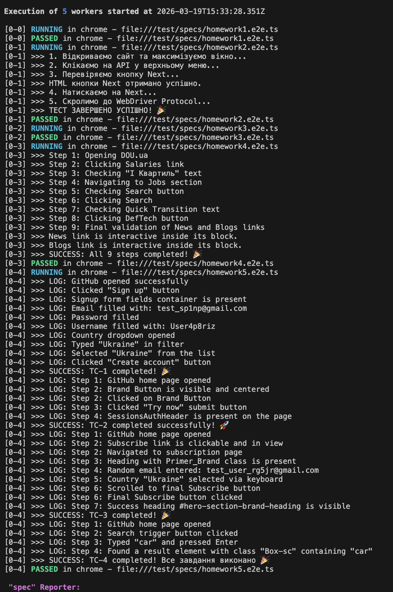
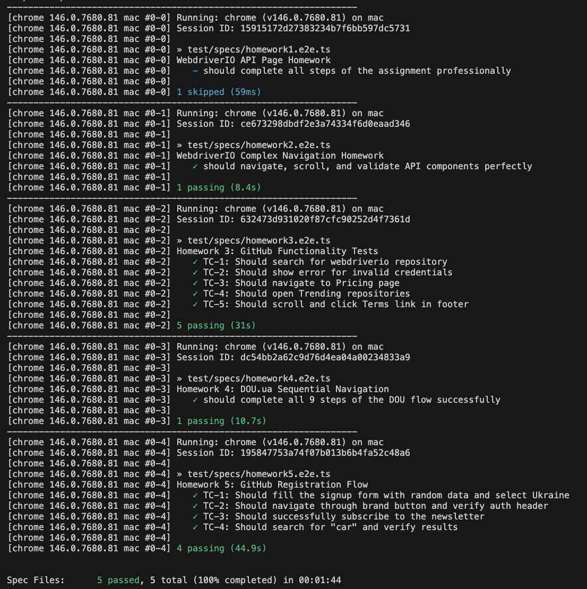

# WebdriverIO Automation Portfolio (Homework 1-5)

Комплексний E2E фреймворк для тестування веб-інтерфейсів (DOU.ua, GitHub.com), побудований з використанням WebdriverIO та TypeScript. Цей проект демонструє вміння працювати зі складним DOM, динамічними елементами та патерном Page Object Model (POM).

## 🛠 Технологічний стек
* **Framework:** WebdriverIO (v8+)
* **Language:** TypeScript
* **Pattern:** Page Object Model (POM)
* **Environment:** Node.js, Chrome / macOS
* **Key Features:** Dynamic selectors handling, complex XPath/CSS strategies, asynchronous element validation, test stability logic.

## 📂 Структура тестів та покриття

### 0. Base Foundation (Homework 1-3)
* **Setup:** Конфігурація WebDriverIO, TypeScript та базових логерів.
* **Locators:** Практика роботи з базовими CSS/XPath селекторами та простими асертами.

### 1. DOU.ua Navigation (Homework 4)
* **Сценарій:** Послідовний перехід від Зарплат до розділів Робота та DefTech/GameDev.
* **Вирішені задачі (R&D):** Зменшення ризику flaky-тестів шляхом обробки динамічної ротації кнопок у головному меню (A/B testing elements) та використання вкладених (nested) селекторів для цільових блоків новин.

### 2. GitHub Comprehensive Flows (Homework 5)
* **TC-1: Registration Form:** Генерація випадкових тестових даних, взаємодія з кастомними dropdown-списками (вибір країни).
* **TC-2: Marketing & Auth:** Взаємодія з компонентами системи дизайну Primer Brand, перевірка редиректів та наявності захищених хедерів авторизації.
* **TC-3: Newsletter Subscription:** Емуляція введення з клавіатури (*browser.keys*) для Select-елементів, обробка асинхронних валідацій форми та розумне використання очікувань (smart waits) замість жорстких пауз.
* **TC-4: Global Search:** Пошук за ключовими словами, обробка динамічних інпутів та регістронезалежна перевірка результатів за допомогою XPath *translate*.

## 📸 Результати виконання (Test Run)





## ⚙️ Запуск проекту (Local Setup)

 
 1. Встановлення залежностей:
 ```bash  
 npm install
 ```
 
 2. Запуск усіх E2E тестів:
 ```bash  
 npx wdio run wdio.conf.ts
 ```  
 
 3. Запуск конкретного тест-кейсу (наприклад, GitHub):
 ```bash
 npx wdio run wdio.conf.ts --spec test/specs/homework5.e2e.ts
 ``` 
